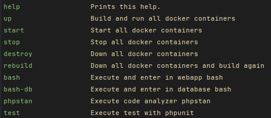

<h1 align="center">
  Shopping Cart in Laravel with DDD, CQRS and Ports and Adapters Architecture
</h1>

### Explanation of my solution
I have chosen to implement my solution in PHP 8.1.8 using the Laravel framework to use the routing, dependency container and some infrastructure helpers.
Finally, I have decided to make a Rest API with endpoints that implement the required actions. To test the features, I recommend use a Postman or similar to call endpoints. More info below.

I have also chosen to persist in Mysql to emulate a more realistic behavior of a shopping cart.

The business logic is decoupled from the framework in the src/ folder trying to using the DDD approach and best practices.

#### Summary of technologies and code practices:

- PHP8.1.8
- Laravel 9.19
- DDD
- Hexagonal architecture
- CQRS
- Own implementation of a simple Query and Command Bus to handle queries and commands.
- MySQL 8
- Event-Driven. System that reflects any relevant business event.
- Own implementation of a simple Event Bus to publish events.
- Stored all events in a store events.
- Implemented a domain serializer that automatically transforms domain data into persistence data, with ValueObjects and Enums
- Docker to up the environment
- PHPstan package to check and fix the code quality
- Makefile to manage environment, tests and phpstan


#### Code folder strucuture
My code is located in the following directories. The rest of the directories are from the framework.
- Apps/ - Controllers  for the Apps using the Domain. Manage the unique entry points at domain.
    - Api/ - Contain the webcontrollers and actions that interacts with the domain. Is the unic entry point to endpoints api
    - Shared - Utils to receive and manage requests and build responses
- Src/  - domain main folder (DDD)
    - Core/ - logic of the main domain
    - Shared/ - Contains the shared code between domains (bounded contexts). In this case only we have one

### Needed tools
1. Unix environtment. Unix SO or WSL for Windows or 
2. [Install Docker](https://www.docker.com/get-started)
3. Install make. 

### Install and up the project
1. Clone this repository
2. Execute ```$ make start```

This command build and run the docker image and docker-compose, install dependencies and configure all systems. Also execute the database migrations and populate with some date of Products.

You can execute ```$ make bash``` to enter at webapp container console. 

Containers:
- The API runs in http://localhost:80
- The mysql runs in: localhost:3306
- The PhpMyAdmin runs in: localhost:8080

#### MakeFile utils
<p>
    
</p>

### API Endpoints

The <strong>Api.postman_collection.json</strong> file has the collection of API requests available with the input data to import into [postman](https://www.postman.com/).

*IMPORTANT: This implementation tries to emulate the behavior of a shopping cart, then a shopping cart is linked to a user (userId). A user is assigned an unique open or pending shopping cart at most.
Some endpoints use the user to performs an action on a cart, so the information of a cart will be obtained through the userId.*

By default, the database is populated with **10 products** to test endpoints. To see these products, you must make a request to the "List of products" endpoint.

Below I provide a few valid uuids to use as a user identifier (cart). With any of these ids, requests can be made to obtain information of the carts. If there is no cart with this user id, it will be created automatically.
- 093a959c-15e2-4406-8883-a6992a0745b1 
- 142fac56-1bb3-4b00-863b-74ac7541fd25 
- 6bd2bb73-5b5d-4ad0-8f41-3d5b8f00cd23 

### POST /api/cart/product/add

Add a product in a cart

**Body:** _required_. User of the cart, product and quantity of products to add into cart. If the user does not have any pending or open shopping cart, open a new one. If he has one, add the product to that cart.

**Content Type** `application/json`

Sample:

```json

{
    "productId": "f3b25f80-7203-4678-9512-bef61f8c9c30",
    "userId": "093a959c-15e2-4406-8883-a6992a0745b1",
    "quantity": 4
}
```

**Responses**:

* **200 OK** When the product added correctly
* **400 Bad Request** When there is a failure in the request format, expected
  headers, or the payload can't be unmarshalled.
* **404 Not Found**. When the product doesn't exists or user cart not found
* **422 Unprocessable Content**. When there is a validation data error

### DELETE /api/cart/product/remove

Remove a product of the cart

**Body:** _required_. Product Id and user of the cart

**Content Type** `application/json`

Sample:

```json
{
    "productId" : "175a048a-f514-4b48-b694-bf18ebf24df5",
    "userId"    : "093a959c-15e2-4406-8883-a6992a0745b1"
}
```

**Responses**:

* **200 OK**. When the product has been removed form the cart
* **400 Bad Request**. When there is a failure in the request format, expected
    headers, or the payload can't be unmarshalled.
* **404 Not Found**. When the product doesn't exists in the cart or user cart not found
* **422 Unprocessable Content**. When there is a validation data error

### GET /api/cart/{userId}/show

Shows info of a cart

**Parameters**: _required_ in path. The user of the cart to show


**Responses**:

* **200 OK** With the data of cart:

Sample:

```json
{
    "id": "491b56cc-da3c-4d1f-b685-2d53dd0ca200",
    "userId": "093a959c-15e2-4406-8883-a6992a0745b1",
    "status": "open",
    "products": [
        {
            "productId": "f3b25f80-7203-4678-9512-bef61f8c9c30",
            "quantity": 1
        },
        {
            "productId": "p3bd7j80-5437-4678-9512-3eas1f8c9c65",
            "quantity": 4
        }
    ]
}
```
* **400 Bad Request** When there is a failure in the request format or the
  payload can't be unmarshalled.
* **404 Not Found**. When the user hasn't open or pending cart
* **422 Unprocessable Content**. When there is a validation data error

### GET /api/product/list

Show list of available products to add in carts

**Responses**:

* **200 OK** With the list of products:

Sample:

```json
[
    {
        "id": "0bc09058-8f71-4ae5-a11c-03344e16f645",
        "name": "Predovic Ltd",
        "description": "Nesciunt voluptate nostrum quo voluptas provident officiis nobis. Ab ducimus sed non rerum. Omnis ut ab tenetur illo.",
        "price": 43.67,
        "priceWithDiscount": 37.54,
        "currency": "EUR",
        "minForDiscount": 2
    },
    {
        "id": "142fac56-1bb3-4b00-863b-74ac7541fd25",
        "name": "Adams PLC",
        "description": "Ullam ipsum nesciunt eaque aperiam sed. Nobis nostrum sint eligendi ut. Voluptatibus consequatur inventore debitis voluptatem enim. Consequuntur blanditiis maxime non fugiat esse qui et.",
        "price": 49.44,
        "priceWithDiscount": 23.59,
        "currency": "EUR",
        "minForDiscount": 2
    }
]
```
### GET /api/cart/list

Show list of carts

**Responses**:

* **200 OK** With the list of carts:

Sample:

```json
[
    {
        "id": "d73e6d04-6b9e-481d-b4d3-0c5f74f0a7c1",
        "userId": "093a959c-15e2-4406-8883-a6992a0745b1",
        "status": "pending",
        "products": [
            {
                "productId": "0bc09058-8f71-4ae5-a11c-03344e16f645",
                "quantity": 2
            },
            {
                "productId": "142fac56-1bb3-4b00-863b-74ac7541fd25",
                "quantity": 3
            }
        ]
    },
    {
        "id": "d73e6d04-6b9e-481d-b4d3-0c5f74f0a7c1",
        "userId": "093a959c-15e2-4406-8883-a6992a0745b1",
        "status": "open",
        "products": []
    }
]
```

### GET /api/cart/{userId}/amount/{currency?}
Calculates the total amount of the cart. If the currency is indicated, the result will show the conversion of the total

**Parameters**: _required_ in path. The user of the cart and the optional currency to convert the result.

**Responses**:

* **200 OK** With the total amounts arranged by "with discount" or "without discount" and by currency

Sample:

```json
{
    "withoutDiscount": {
        "EUR": {
            "price": 235.66
        },
        "USD": {
            "price": 239.93
        }
    },
    "withDiscount": {
        "EUR": {
            "price": 145.85
        },
        "USD": {
            "price": 148.49
        }
    }
}
```
* **400 Bad Request** When there is a failure in the request format or the
  payload can't be unmarshalled.
* **404 Not Found**. When the user hasn't open or pending cart
* **422 Unprocessable Content**. When there is a validation data error


### Tests ###
To execute the tests, you can run `make test`


### PHPStan ###
To execute the PHPStan code analyser, run `make phpstan`


-----


Please, if you need it, we comment anything about the challenge.

**Thanks!!! And sorry for my english.**
